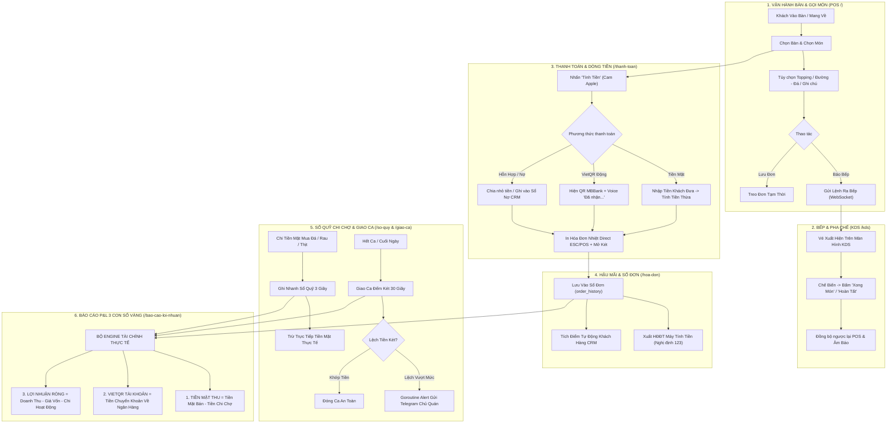

# 👑 FLOW LUỒNG NGHIỆP VỤ TOÀN DỰ ÁN ONGCHU LEAN POS

Tài liệu chuẩn hóa toàn bộ vòng đời dữ liệu và luồng thao tác thực chiến từ khi khách vào quán cho đến khi Chủ quán chốt sổ lợi nhuận cuối ngày.

---

## 🗺️ 1. SƠ ĐỒ TỔNG THỂ VÒNG ĐỜI VẬN HÀNH (END-TO-END FLOW)

---

## 🎯 2. CHI TIẾT 6 PHÂN HỆ NGHIỆP VỤ

### Luồng 1: Bán Hàng & Gọi Món Nhanh (`/`)
1. **Chọn khu vực & bàn**: Sơ đồ bàn trực quan, đổi màu theo trạng thái (`Trống` #FFFFFF, `Có Khách` #FEF3C7, `Đã Đặt` #E0E7FF).
2. **Gọi món 1 chạm**: Bấm `+` thêm nhanh món, chọn Modifier (Đường/Đá/Topping) nếu có.
3. **Multi-Table Cart**: Mỗi bàn giữ 1 giỏ hàng riêng biệt trong bộ nhớ Zustand, chuyển đổi giữa các bàn 0ms không giật lag.
4. **Nghiệp vụ bàn**: Chuyển bàn, gộp bàn, tách bàn, đổi giá/chiết khấu.

### Luồng 2: Điều Phối Bếp / Bar KDS (`/kds`)
1. **Realtime Broadcast**: Lệnh báo bếp truyền qua Go WebSocket Hub (`/ws/pos`) tới màn hình KDS trễ < 50ms.
2. **Phân loại trạm**: Tự tách món theo trạm pha chế (`bar`) hoặc bếp nấu (`kitchen`).
3. **Cảnh báo trễ đơn**: Đổi màu thẻ theo thời gian chờ (Xanh < 5p -> Vàng 5-10p -> Đỏ > 10p kèm nhấp nháy).

### Luồng 3: Thanh Toán Thông Minh & Mở Két (`/thanh-toan`)
1. **Nút Cam Apple `#B45309`**: Luồng nút thanh toán nổi bật xuyên suốt từ giỏ hàng đến màn hoàn tất.
2. **VietQR Tự Động**: Tạo mã QR VietQR chuẩn NAPAS đúng chính xác số tiền lẻ đến từng đồng; Webhook ngân hàng bắn về tự động xác nhận và phát loa AI: *"Đã nhận 45.000 đ từ VietQR"*.
3. **In Nhiệt & Mở Két**: Gửi byte raw ESC/POS qua TCP Socket Port 9100, kích xung mở két RJ11 `\x1b\x70\x00\x19\xfa` và tự cắt giấy.

### Luồng 4: Sổ Đơn & Khách Hàng CRM (`/hoa-don`)
1. **Quản lý hóa đơn**: Tra cứu lịch sử bill, in lại hóa đơn, xem chi tiết món.
2. **Kiểm soát hủy món / hủy bill**: Bắt buộc nhập lý do -> Gửi cảnh báo gian lận về Telegram chủ quán.
3. **Xuất HĐĐT**: Hỗ trợ tích hợp Hóa đơn điện tử máy tính tiền Nghị định 123 / Thông tư 78.

### Luồng 5: Sổ Quỹ Chi Chợ & Giao Ca Két (`/so-quy` & `/giao-ca`)
1. **Sổ Quỹ Chi Chợ 3 Giây**: Nhân viên bấm tạo nhanh phiếu chi (mua đá, rau củ, gia vị, ứng lương) -> trừ ngay vào dòng tiền mặt.
2. **Giao Ca Đếm Két 30 Giây**: Bàn giao tiền mặt thực tế khi đổi ca -> Tính toán tiền chênh lệch (Thừa / Thiếu) so với dữ liệu máy.

### Luồng 6: Báo Cáo P&L Vị Chủ Quán (`/bao-cao-loi-nhuan`)
Chủ quán nắm toàn bộ sức khỏe tài chính quán qua **3 Con Số Vàng**:
1. 💵 **Tiền mặt thu thực tế**: `Tổng bán tiền mặt - Tổng tiền đã chi chợ`.
2. 📱 **Tiền VietQR**: `Tổng tiền đã ting ting về tài khoản ngân hàng`.
3. 🏆 **Lợi nhuận ròng bỏ túi**: `Doanh thu - Giá vốn món (BOM) - Chi phí vận hành`.

---

## 🔒 3. MA TRẬN PHÂN QUYỀN 4 CẤP VAI TRÒ

| Màn Hình / Nghiệp Vụ | Phục Vụ (`server`) | Thu Ngân (`cashier`) | Quản Lý (`manager`) | Chủ Quán (`owner`) |
|---|:---:|:---:|:---:|:---:|
| **Bán Hàng POS (`/`)** | ✅ | ✅ | ✅ | ✅ |
| **Bếp KDS (`/kds`)** | ✅ | ✅ | ✅ | ✅ |
| **Màn Phụ Khách CFD (`/cfd`)** | ✅ | ✅ | ✅ | ✅ |
| **Sổ Đơn (`/hoa-don`)** | Chỉ xem | In bill / Thu tiền | Toàn quyền | Toàn quyền |
| **Sổ Quỹ Chi Chợ (`/so-quy`)** | ❌ | Chi ca mình | Chi chi nhánh | Toàn quyền chuỗi |
| **Giao Ca Két (`/giao-ca`)** | ❌ | Bàn giao ca | Chốt ca chi nhánh | Kiểm toán chuỗi |
| **Báo Cáo P&L (`/bao-cao-loi-nhuan`)** | ❌ | ❌ | Xem chi nhánh | Toàn quyền chuỗi |
| **Cài Đặt Hệ Thống / VietQR (`/cai-dat`)** | ❌ | ❌ | ❌ | ✅ |
