# 👑 OngChu Lean POS — Universal Omnichannel F&B Platform
> **Hệ Thống Bán Hàng & Quản Trị F&B Thực Chiến — Cái Tâm Vị Chủ Quán**
> 
> *Đa Nền Tảng Siêu Nhẹ:* Windows Desktop Native (.exe 15MB) · iPad & iPhone (iOS Safari PWA) · Android POS (Sony Xperia / Sunmi / iMin) · Web Cloud ([app.ongchu.cloud](https://app.ongchu.cloud))

<p align="center">
  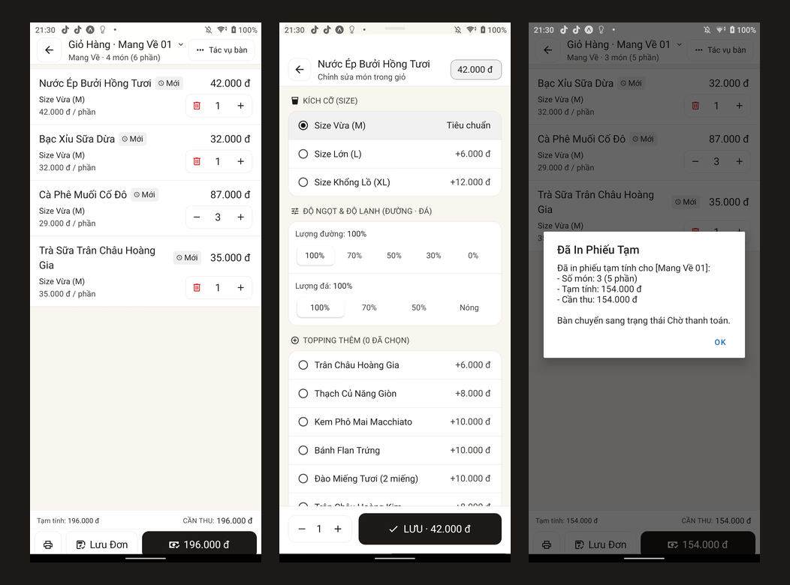
</p>

<p align="center">
  <a href="https://ongchu.cloud"></a>
  <a href="https://app.ongchu.cloud"></a>
  <a href="https://github.com/nguyenlocthanh796/duangoimon/releases"></a>
  
  
  
  
</p>

---

## 🏛️ 1. Tổng Quan Hệ Sinh Thái & Triết Lý Vị Chủ Quán

**OngChu POS** là hệ sinh thái quản lý và vận hành điểm bán (Point-of-Sale) chuyên sâu dành riêng cho ngành F&B (Nhà hàng, Quán Cà Phê, Trà Sữa, Quán Ăn, Tiệm Bánh, Quán Nhậu và Chuỗi Đa Chi Nhánh).

Hệ thống được kiến tạo xoay quanh triết lý **"Vị Chủ Quán (Zero-Gov & Lean Operator)"**:
* **Không làm phiền chủ quán**: Bỏ qua các quy trình hành chính rườm rà. Thao tác gọi món, in bill và thanh toán đạt tốc độ cảm ứng dưới **50ms**.
* **3 Giây Sổ Quỹ Chi Chợ**: Ghi nhận tức thì các khoản tiền mặt chi thực tế trong ngày (đá, rau, thịt, ứng lương) ngay tại quầy thu ngân.
* **30 Giây Giao Ca Đếm Két**: Khóa ca chính xác bằng bảng đếm mệnh giá tiền mặt, tự động đối soát chênh lệch két và ghi nhật ký kiểm toán.
* **3 Con Số Vàng Lợi Nhuận**: Nắm bắt bức tranh tài chính chuẩn xác mỗi ngày: `Tiền mặt trong két` + `Tiền tài khoản VietQR` = `Lợi nhuận ròng thực tế`.
* **Bảo vệ dòng tiền tuyệt đối**: Hệ thống Goroutine ngầm tự động gửi tin nhắn cảnh báo tức thì qua Telegram khi phát hiện hủy món sau in tạm tính, chiết khấu hóa đơn > 20% hoặc mở két tiền bằng tay.

---

## ⚡ 2. 6 Trụ Cột Kỹ Thuật Bất Biến (Core Invariants)

| # | Trụ Cột | Hiện Thực Kỹ Thuật | Giá Trị Thực Chiến |
|---|---|---|---|
| **1** | **Vị Chủ Quán (Lean Operator)** | Sổ quỹ chi chợ 3s (`/so-quy`), Giao ca đếm két 30s (`/giao-ca`), Báo cáo 3 con số vàng (`/bao-cao-loi-nhuan`), Goroutine Telegram chống gian lận. | Chủ quán nắm rõ tài chính tức thì trong ngày, kiểm soát thất thoát mà không phụ thuộc kế toán. |
| **2** | **Backend Siêu Tốc (15MB)** | Golang 1.22+ Gin / Fiber (boot 0.05s, RAM <15MB), WebSocket Hub (`/ws/pos`) đồng bộ tức thì KDS & Màn hình phụ CFD, GORM Auto-Migrate PostgreSQL 16 & SQLite. | Hoạt động trơn tru trên VPS cấu hình tối thiểu, chịu tải hàng ngàn request đồng thời với độ trễ siêu thấp. |
| **3** | **In Nhiệt Direct ESC/POS** | Raw TCP Socket trực tiếp (Port 9100, không cần Windows Spooler / Driver), kích xung mở két tiền RJ11 `\x1b\x70\x00\x19\xfa`, tự động cắt giấy `\x1d\x56\x41\x10`. | Tốc độ in hóa đơn K80/K58 tức thì, không bị treo spooler hoặc phụ thuộc driver rườm rà. |
| **4** | **Frontend Universal Đa Nền Tảng** | 1 Codebase Expo SDK 57 (React Native 0.86.3, React 19), Zustand Multi-Table Cart Engine (<1KB, Zero DOM lag), Shopify FlashList 60 FPS mượt mà. | Chạy mượt trên mọi thiết bị: Windows PC, iPad, điện thoại Android, máy POS cầm tay Sunmi / iMin. |
| **5** | **Thẩm Mỹ Dual-Theme Indochine** | Light Mode (Ngà Giấy Dó `#F9F6F0` / Gỗ Mun `#1C1917`), Dark Mode (Nâu Than `#14110E`), Điểm nhấn Cam Apple `#B45309`. Tabular Nums 100%, Thang đo 7 cấp typography. | Chống lóa mắt trong môi trường quầy bar / thu ngân, hiển thị số tiền và mã hóa đơn thẳng hàng tuyệt đối. |
| **6** | **Chống Gian Lận & Offline-First** | Hoạt động bán hàng độc lập khi mất Internet qua SQLite cục bộ, đồng bộ tự động khi có mạng. Audit Log lưu vết hủy món và sửa đơn. | Quán không bao giờ bị gián đoạn bán hàng, phòng ngừa tiêu cực và thất thoát tiền mặt nội bộ. |

---

## 📱 3. Kiểm Thử Thiết Bị Thật & Bộ Ảnh Chụp Nghiệp Vụ

### 3.1. Thao Tác Trên Thiết Bị Di Động Thực Tế (Sony Xperia 5 — CinemaWide 21:9 OLED)
Hệ thống được kiểm thử thực tế trên thiết bị vật lý qua ADB JSON-RPC Server, tối ưu hóa công thái học cảm ứng với vùng chạm tối thiểu **44 × 44pt** và phản hồi Haptics chân thực:

<p align="center">
  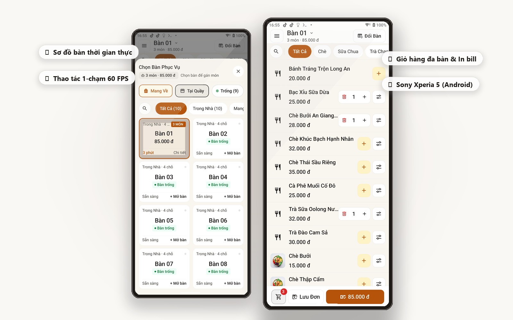
</p>

### 3.2. 12 Màn Hình Nghiệp Vụ Thực Tế Có Chú Thích Chỉ Dẫn

<div align="center">
  <table>
    <tr>
      <td width="25%" align="center">
        <a href="screenshots/01_pos_table_overview.png">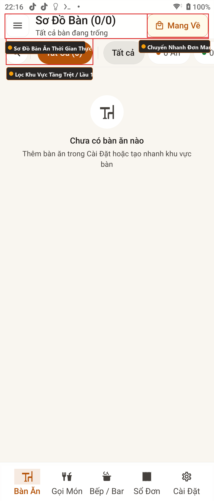</a><br/>
        <sub><b>1. Sơ Đồ Bàn Ăn Realtime</b></sub>
      </td>
      <td width="25%" align="center">
        <a href="screenshots/02_pos_menu_ordering.png">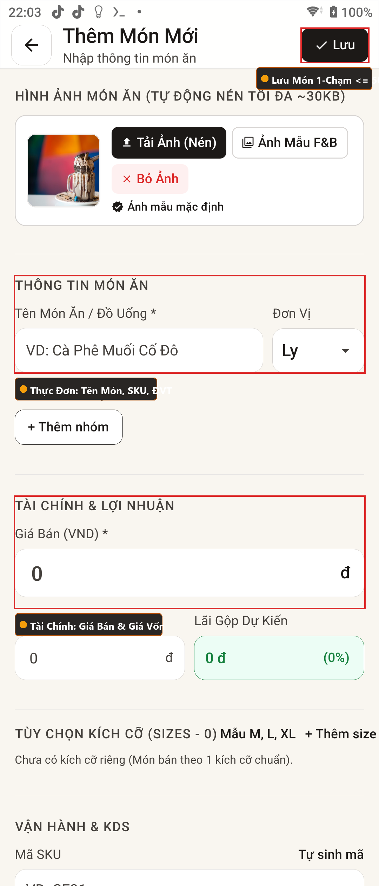</a><br/>
        <sub><b>2. Thực Đơn & Giá Vốn</b></sub>
      </td>
      <td width="25%" align="center">
        <a href="screenshots/03_pos_modifier_toppings.png">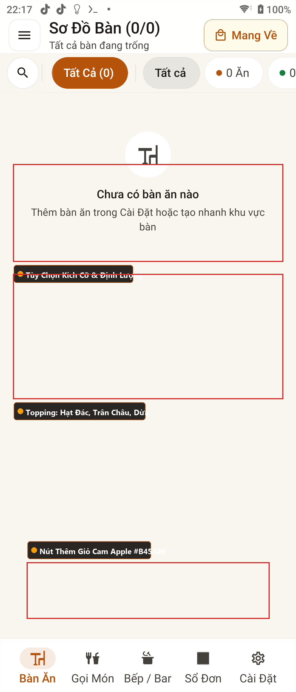</a><br/>
        <sub><b>3. Size & Topping Món</b></sub>
      </td>
      <td width="25%" align="center">
        <a href="screenshots/04_pos_cart_tray.png">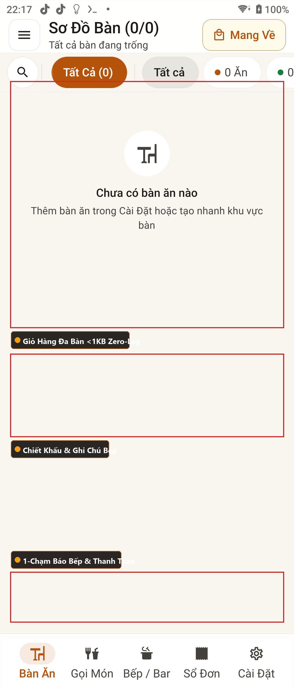</a><br/>
        <sub><b>4. Giỏ Hàng Đa Bàn</b></sub>
      </td>
    </tr>
    <tr>
      <td width="25%" align="center">
        <a href="screenshots/05_pos_numpad_cash.png">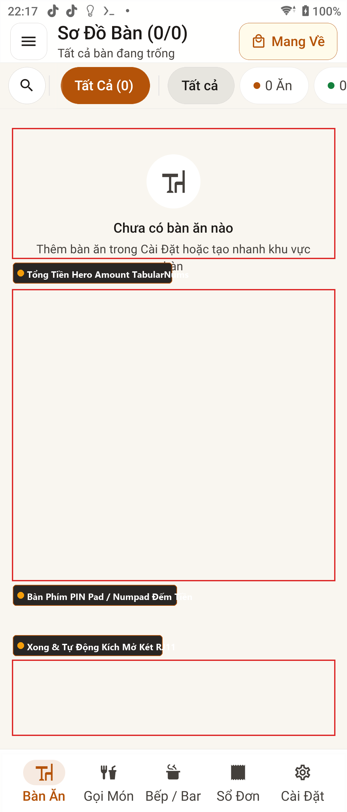</a><br/>
        <sub><b>5. Numpad Đếm Tiền Mặt</b></sub>
      </td>
      <td width="25%" align="center">
        <a href="screenshots/06_pos_dynamic_vietqr.png">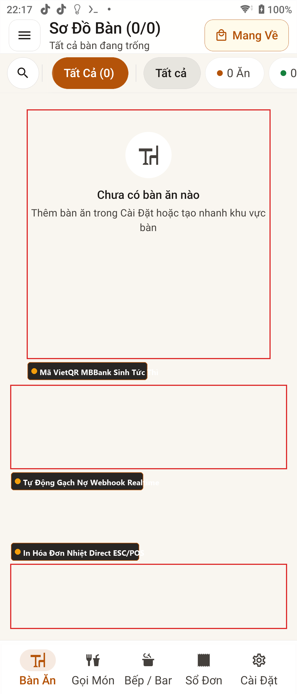</a><br/>
        <sub><b>6. Mã VietQR Động NAPAS</b></sub>
      </td>
      <td width="25%" align="center">
        <a href="screenshots/07_pos_kds_kitchen.png">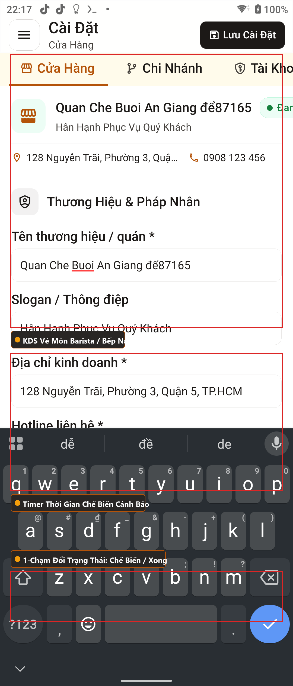</a><br/>
        <sub><b>7. Bếp / Bar KDS Vé Món</b></sub>
      </td>
      <td width="25%" align="center">
        <a href="screenshots/08_pos_invoices_history.png">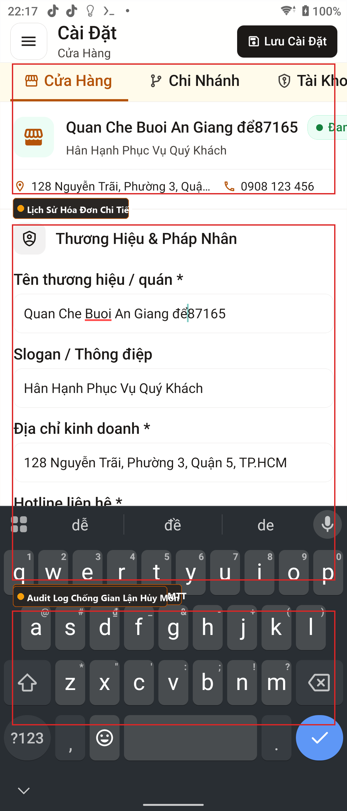</a><br/>
        <sub><b>8. Sổ Đơn & In Lại Bill</b></sub>
      </td>
    </tr>
    <tr>
      <td width="25%" align="center">
        <a href="screenshots/09_pos_cashflow_expenses.png">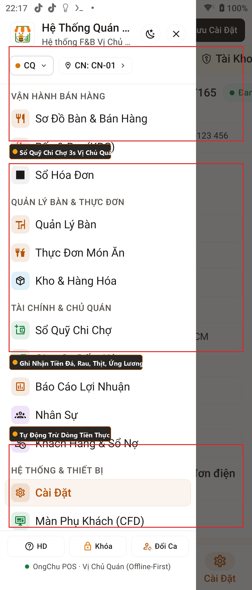</a><br/>
        <sub><b>9. Sổ Quỹ Chi Chợ 3s</b></sub>
      </td>
      <td width="25%" align="center">
        <a href="screenshots/10_pos_shift_handover.png">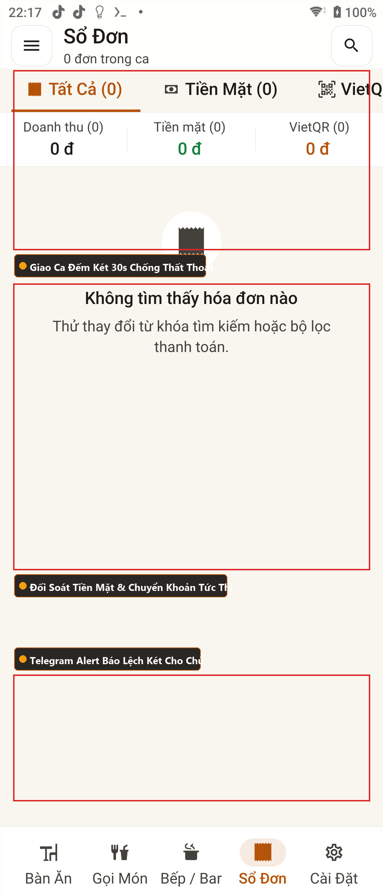</a><br/>
        <sub><b>10. Giao Ca Két Tiền 30s</b></sub>
      </td>
      <td width="25%" align="center">
        <a href="screenshots/11_pos_pnl_report.png">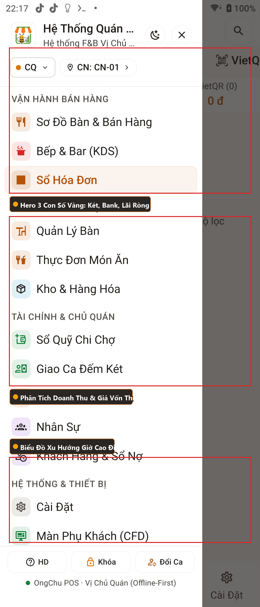</a><br/>
        <sub><b>11. Báo Cáo 3 Con Số Vàng</b></sub>
      </td>
      <td width="25%" align="center">
        <a href="screenshots/12_pos_settings_printer.png">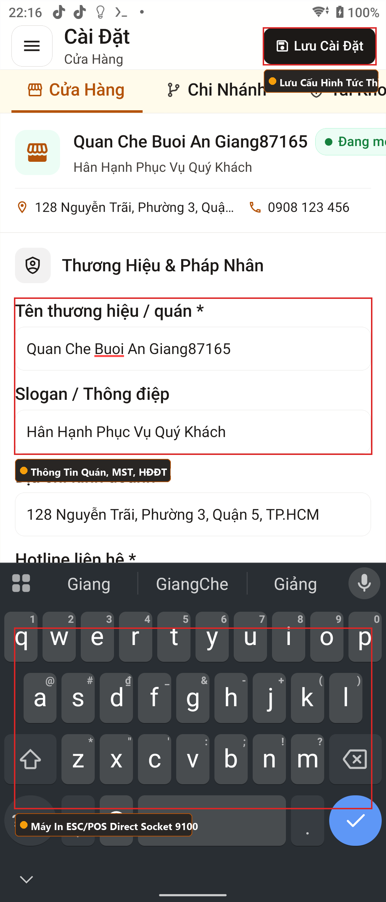</a><br/>
        <sub><b>12. Máy In Nhiệt & Két Tiền</b></sub>
      </td>
    </tr>
  </table>
</div>

---

## 🛡️ 4. Bảo Mật Toàn Diện 4 Vành Đai (Security Hardening)

Hệ thống tuân thủ quy chuẩn bảo mật nghiêm ngặt chống xâm nhập và gian lận:
1. **Vành đai 1: Zero-Source Deployment**: Không lưu trữ mã nguồn `.go`/`.ts`/`.git` trên VPS Production. Chỉ triển khai Stripped Binary Go (`-s -w -trimpath`) và Hermes Bytecode (`.hbc`) trên Mobile.
2. **Vành đai 2: Chống MITM & Ký Số Request**: 100% kết nối qua TLS 1.3/HSTS. Xác thực tính toàn vẹn gói tin bằng chữ ký số HMAC-SHA256 (`X-Signature`, `X-Timestamp`, `X-Nonce` TTL 30s chống tấn công phát lại Replay Attack).
3. **Vành đai 3: Đóng Băng Hệ Điều Hành & CSDL**: CSDL PostgreSQL 16 & Redis 7 cô lập trong Docker Network nội bộ (CẤM bind `0.0.0.0`). Tường lửa UFW chỉ mở cổng Web HTTPS (443) và SSH đổi port.
4. **Vành đai 4: Kiểm Soát Đa Khách Thuê & Chống Gian Lận (Multi-Tenant Isolation)**: Ràng buộc phân tách dữ liệu tuyệt đối giữa các quán (`tenant_id` scope bắt buộc trên 100% query GORM), Rate Limiting Token Bucket và Audit Logs bất biến (Append-Only).

---

## 💻 5. Bảng Điều Phối Cổng & Môi Trường (Port Matrix)

| Phân Hệ | Thư Mục | Công Nghệ | Cổng Mặc Định | Nhiệm Vụ Trọng Tâm |
| :--- | :--- | :--- | :--- | :--- |
| **Frontend Mobile & Web** | `/frontend` | Expo SDK 57, React Native 0.86, Zustand | `8085` | 10 Màn hình nghiệp vụ chính, Zero-Modal Inline Navigation |
| **Golang Backend** | `/backend` | Go 1.22+, Gin, GORM, WebSocket Hub | `8080` | RESTful APIs, WebSocket Hub `/ws/pos`, ESC/POS Direct Socket |
| **Database & Cache** | `docker-compose` | PostgreSQL 16 Alpine, Redis 7 | `5432` / `6379` | Sổ kế toán kép, lưu vết Audit Logs, Caching dữ liệu |
| **Máy In Nhiệt ESC/POS** | Mạng LAN | TCP Raw Socket | `9100` | In hóa đơn K80/K58 trực tiếp, kích mở ngăn kéo đựng tiền RJ11 |
| **Desktop Wrapper** | `/desktop` | Tauri 2.0 (Rust Core) | N/A (`.exe`) | Đóng gói Windows Native siêu nhẹ (~10MB, tiêu thụ ~15MB RAM) |
| **Android ADB Testing** | `/scripts` | Python JSON-RPC MCP Server | ADB Stdio | Kiểm thử tự động trên thiết bị Android thật (Sony Xperia 5 / Tablet) |

---

## 🚀 6. Hướng Dẫn Tải & Trải Nghiệm (Releases)

| Nền Tảng | Định Dạng | Liên Kết Tải / Truy Cập | Ghi Chú |
|---|---|---|---|
| **Web POS Trực Tiếp** | PWA Cloud | [Mở app.ongchu.cloud](https://app.ongchu.cloud) | Chạy ngay trên Chrome, Safari, Edge mà không cần cài đặt |
| **Cổng Thông Tin Giải Pháp** | Marketing Showroom | [Truy cập ongchu.cloud](https://ongchu.cloud) | Xem bảng so sánh tính năng, quy trình 8 bước và tải bản cài đặt |
| **Windows Desktop Native** | `.exe` (~15MB) | [Tải Bản Windows .EXE](https://github.com/nguyenlocthanh796/duangoimon/releases/latest) | Bản Portable độc lập, siêu mượt, kết nối trực tiếp máy in cổng LAN |
| **Android Phone / Tablet** | `.apk` (~25MB) | [Tải Bản Android APK](https://github.com/nguyenlocthanh796/duangoimon/releases/latest) | Tương thích máy POS Sunmi, iMin và điện thoại Android 8.0+ |

---

## 🛠️ 7. Hướng Dẫn Khởi Chạy Tự Triển Khai (Self-Hosted Quickstart)

### 7.1. Khởi động CSDL PostgreSQL & Redis:
```bash
docker-compose up -d
```

### 7.2. Khởi động Golang Backend:
```bash
cd backend
go run cmd/server/main.go
# Health check: http://localhost:8080/health
```

### 7.3. Khởi động Frontend Universal (Expo SDK 57):
```bash
cd frontend
npm install
npm run dev
# Mở trình duyệt tại: http://localhost:8085
```

### 7.4. Đóng gói ứng dụng Desktop (Tauri 2.0):
```bash
cd desktop
npm run tauri build
```

---

## 📋 8. Quy Trình Vận Hành Chuẩn F&B (SOP)

### 8.1. Quy Trình Bán Hàng & Tính Tiền (Dưới 3 Giây)
1. **Mở Bàn / Chọn Bàn**: Chạm vào bàn trên Sơ Đồ Bàn -> Chọn món ăn hoặc quét mã vạch SKU.
2. **Tùy Chọn Topping & Ghi Chú**: Chọn kích cỡ ly, lượng đá/đường và món thêm -> Bấm `Thêm Vào Giỏ`.
3. **Báo Bếp / Lưu Đơn**: Bấm `Lưu Đơn & Báo Bếp` -> Lệnh in tự động đẩy xuống máy in bếp hoặc màn hình KDS.
4. **Thanh Toán**:
   - **Tiền Mặt**: Bấm Numpad số tiền khách đưa -> Hệ thống tự tính tiền thừa -> Bấm `Hoàn Tất & In Bill` (Két tiền RJ11 tự động bật mở).
   - **VietQR Động**: Chuyển tab VietQR -> Khách quét mã chính xác số tiền -> Webhook tự động chốt đơn sau 1 giây.

### 8.2. Quy Trình Chi Chợ & Giao Ca Đếm Két
1. **Ghi Chi Chợ 3s**: Mở `/so-quy` -> Chọn loại chi (Đá, Rau củ, Thịt cá, Gas, Phụ phí) -> Nhập số tiền -> Bấm `Lưu Phiếu Chi` (Tự động trừ két).
2. **Giao Ca Đếm Két 30s**: Mở `/giao-ca` -> Nhập số tờ từng mệnh giá tiền mặt trong két -> Bấm `Tổng Kết Ca`. Nếu phát hiện chênh lệch, hệ thống lập tức gửi cảnh báo đến Telegram Chủ Quán.
3. **Tổng Kết Lợi Nhuận**: Mở `/bao-cao-loi-nhuan` kiểm tra 3 Con Số Vàng: Tiền mặt trong két, Tiền trong tài khoản và Lợi nhuận ròng thực tế bỏ túi.

---

## 📄 9. Bản Quyền & Hỗ Trợ Kỹ Thuật

- **Bản Quyền**: © 2026 OngChu POS. Mọi quyền được bảo lưu.
- **Website Chính Thức**: [https://ongchu.cloud](https://ongchu.cloud)
- **Email Hỗ Trợ & Triển Khai**: `hotro@ongchu.cloud`
- **Báo Cáo Sự Cố**: [GitHub Issues](https://github.com/nguyenlocthanh796/duangoimon/issues)
