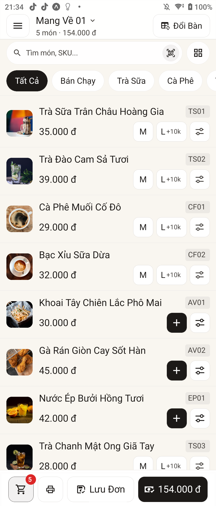
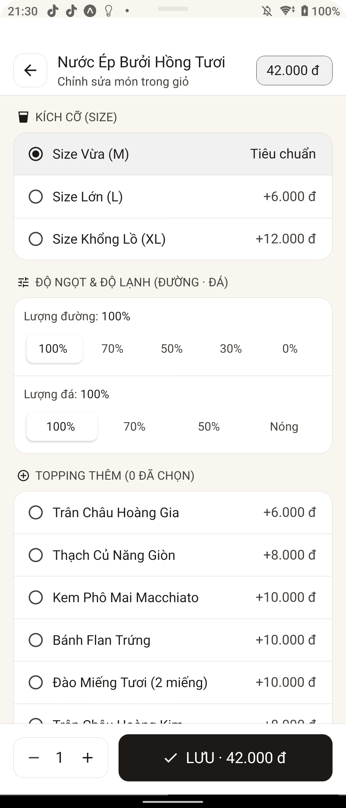
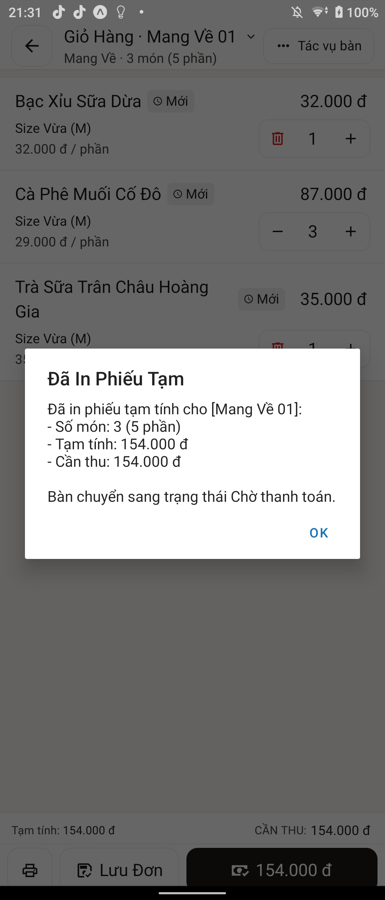

# OngChu POS — Lean F&B Point of Sale Platform

  

  
  
  
  
  

---

## 1. Executive Summary

**OngChu POS** is an enterprise-grade, ultra-lightweight Point-of-Sale and management ecosystem built specifically for F&B businesses, including Cafes, Milk Tea Shops, Restaurants, Quick-Service Counters, and Multi-Branch Chains.

Designed around the **"Zero-Gov / Lean Operator"** philosophy, the system eliminates administrative friction while enforcing absolute cash security, real-time audit trails, and sub-second touch latency.

- **Web POS**: [https://app.ongchu.cloud](https://app.ongchu.cloud) (Instant deployment, zero installation required)
- **Windows Native**: Ultra-light ~12MB standalone binary with minimal RAM footprint (<20MB)
- **Mobile & Tablet**: High-performance 60 FPS Native engine across iOS and Android

---

## 2. Core Operational Pillars

| Pillar | Technical Implementation | Operational Value |
|---|---|---|
| **1-Touch Ordering** | Multi-table state machine with instant seat/order switching | Order processing and bill split execution under 3 seconds |
| **Instant Petty Cash (`/so-quy`)** | Real-time petty expense journal with auto-ledgering | Direct cash-out tracking (ice, fresh produce, salary advances) |
| **Cash Drawer Audit (`/giao-ca`)** | Exact cash counting and shift balance reconciliation | Instant variance detection and automatic shift handover reporting |
| **3 Golden Numbers P&L (`/bao-cao-loi-nhuan`)** | Real-time formula: `Drawer Cash` + `Bank VietQR` = `Net Profit` | Zero-latency financial clarity without complex accounting delays |
| **Direct ESC/POS Thermal Printing** | Native Raw TCP Socket (Port 9100) with RJ11 pulse triggers | Driverless LAN printing (K80/K58) and automated paper cutting |
| **Active Anti-Fraud Engine** | Real-time Telegram goroutine alerts on high-risk events | Instant notification for voided items, high discounts (>20%), and manual drawer kicks |

---

## 3. Product Gallery

  <table>
    <tr>
      <td width="50%" align="center">
         
        <b>Table Layout & Area Zoning</b>
      </td>
      <td width="50%" align="center">
         
        <b>Menu Ordering & Instant Customization</b>
      </td>
    </tr>
    <tr>
      <td width="50%" align="center">
         
        <b>Rapid Cash Numpad & Change Calculation</b>
      </td>
      <td width="50%" align="center">
         
        <b>Dynamic VietQR & MB Soundbox Integration</b>
      </td>
    </tr>
    <tr>
      <td width="50%" align="center">
         
        <b>Kitchen / Barista Display System (KDS)</b>
      </td>
      <td width="50%" align="center">
         
        <b>3 Golden Numbers P&L Real-Time Analytics</b>
      </td>
    </tr>
    <tr>
      <td width="50%" align="center">
         
        <b>3-Second Petty Cash Flow Ledger</b>
      </td>
      <td width="50%" align="center">
         
        <b>Shift Closing & Drawer Reconciliation</b>
      </td>
    </tr>
  </table>

---

## 4. Platform Distribution & Downloads

| Platform | Format | Release Link | Notes |
|---|---|---|---|
| **Windows Desktop** | `.exe` (~12MB) | [Download Windows App](https://github.com/nguyenlocthanh796/duangoimon/releases/latest) | Standalone portable executable, no runtime required |
| **Android Tablet & Phone** | `.apk` (~25MB) | [Download Android APK](https://github.com/nguyenlocthanh796/duangoimon/releases/latest) | Compatible with POS handheld terminals, Android 8.0+ |
| **Universal Web App** | PWA | [Launch Web POS](https://app.ongchu.cloud) | Instant cloud sync, offline-ready local cache |

---

## 5. Operational Documentation (SOP)

Detailed operating procedures for cashiers, managers, and store owners:

- [Standard Operating Procedure: POS Sales & Order Management](docs/01_huong_dan_ban_hang.md)
- [Petty Cash Management: 3-Second Market Expense Ledger](docs/02_so_quy_chi_cho.md)
- [Shift Reconciliation: 30-Second Cash Drawer Audit](docs/03_giao_ca_dem_ket.md)
- [Hardware Integration: ESC/POS Thermal Printers & Cash Drawers](docs/04_ket_noi_may_in.md)
- [Security Controls: Telegram Anti-Fraud Configuration](docs/05_chong_gian_lan_telegram.md)

---

## 6. Enterprise Security & Architecture Standards

1. **Zero-Source Deployment**: Production environments execute exclusively stripped, hardened binaries. No application source code or raw database files are exposed on public hosts.
2. **Deterministic Multi-Tenancy**: Complete logical separation of store configurations, catalog metadata, inventory ledgers, and transaction histories.
3. **Double-Entry Cash Controls**: Cash movements are strictly immutable, requiring explicit manager PIN verification and audit reason logging for all post-print modifications.
4. **Hardware-Direct Thermal Printing**: Bypass OS print spoolers with direct TCP socket communication, ensuring immediate receipt generation and cash drawer triggers.

---

## 7. Support & Community

- **Issue Tracker**: [Submit Bug Report](https://github.com/nguyenlocthanh796/duangoimon/issues/new?template=bug_report.md)
- **Feature Requests**: [Submit Proposal](https://github.com/nguyenlocthanh796/duangoimon/issues/new?template=feature_request.md)
- **Official Website**: [https://ongchu.cloud](https://ongchu.cloud)
- **Technical Hotline & Zalo**: `0392.387.165`

---

  Copyright © 2026 OngChu POS Ecosystem. All rights reserved.

