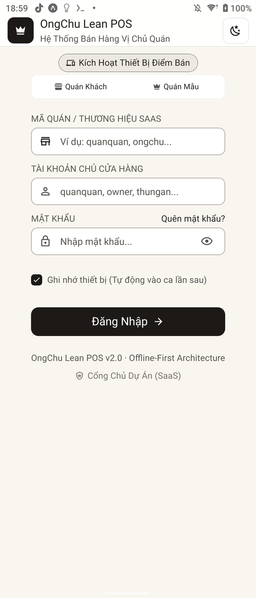
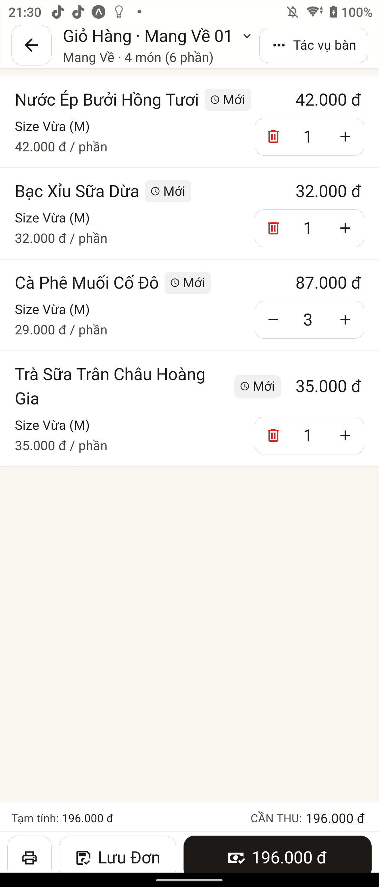
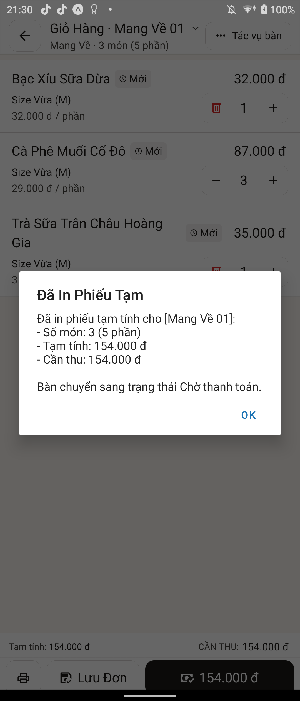

# 👑 OngChu POS — Hệ Thống Quản Lý Bán Hàng F&B Thực Chiến Vị Chủ Quán

  

  
  
  
  

---

## 📖 Giới Thiệu
**OngChu POS** là hệ thống quản trị và bán hàng F&B chuyên sâu dành cho Quán Cafe, Trà Sữa, Quán Ăn, Nhà Hàng và Chuỗi F&B. Dự án được thiết kế xoay quanh triết lý **"Cái Tâm Vị Chủ Quán"** — cắt giảm 100% thủ tục rườm rà, tập trung tuyệt đối vào tốc độ phục vụ, an toàn dòng tiền và chống gian lận nội bộ.

- **🌐 Nền tảng Web POS**: [https://app.ongchu.cloud](https://app.ongchu.cloud) (Mở trình duyệt là bán hàng ngay).
- **💻 Bản Desktop Windows**: Siêu nhẹ ~12MB, không tốn RAM.
- **📱 Bản Mobile & Tablet**: Hoạt động mượt mà 60 FPS trên Android và iOS.

---

## 🌟 6 Trụ Cột Đột Phá

| # | Trụ Cột | Chi Tiết Nghiệp Vụ |
|---|---|---|
| 🛒 | **Bán Hàng 1-Chạm** | Gọi món, chuyển bàn, gộp bàn, tách hóa đơn, in tạm tính chỉ trong < 3 giây. |
| 🥬 | **Sổ Quỹ Chi Chợ 3s** | Nhập tiền mua đá, rau, thịt, ứng lương tức thì ngay trên POS. Tự động trừ vào két tiền ca. |
| 💵 | **Giao Ca Đếm Két 30s** | Đối soát tiền mặt thực tế và doanh thu hệ thống. Tự động phát hiện lệch két và cảnh báo. |
| 📊 | **3 Con Số Vàng P&L** | Báo cáo lợi nhuận thực: (1) Tiền mặt trong két, (2) Tiền chuyển khoản ngân hàng, (3) Lợi nhuận ròng. |
| 🖨️ | **In Nhiệt ESC/POS Direct** | Kết nối trực tiếp máy in mạng LAN K80/K58 (Port 9100) và két tiền RJ11 không cần cài driver. |
| 🚨 | **Báo Động Gian Lận Realtime** | Gửi tin nhắn tức thì về Telegram Chủ Quán khi hủy món sau in tạm tính, sửa hóa đơn hoặc mở két tay. |

---

## 📸 Giao Diện Trực Quan

  <table>
    <tr>
      <td width="50%"> <b>Sơ đồ bàn & Đặt món trực quan</b></td>
      <td width="50%"> <b>Thanh toán tiền mặt & Numpad đếm tiền</b></td>
    </tr>
    <tr>
      <td width="50%"> <b>Màn hình điều phối Bếp / Pha chế (KDS)</b></td>
      <td width="50%"> <b>Báo cáo 3 con số vàng Lợi Nhuận Thực</b></td>
    </tr>
  </table>

---

## 📥 Tải Bản Cài Đặt (Releases)

| Nền Tảng | Định Dạng | Tải Về | Hướng Dẫn |
|---|---|---|---|
| **Windows Desktop** | `.exe` (~12MB) | [Tải Bản Windows](https://github.com/ongchu-pos/ongchu-pos/releases/latest) | Chạy trực tiếp, không cần cài đặt |
| **Android Tablet & Phone** | `.apk` (~25MB) | [Tải Bản Android](https://github.com/ongchu-pos/ongchu-pos/releases/latest) | Cài đặt cho máy POS cầm tay / Tablet |
| **Trình Duyệt Web** | Web PWA | [Mở Web POS](https://app.ongchu.cloud) | Tương thích Chrome, Safari, Edge, Cốc Cốc |

---

## 📚 Tài Liệu Hướng Dẫn Vận Hành
- [01. Hướng Dẫn Bán Hàng & Gọi Món](docs/01_huong_dan_ban_hang.md)
- [02. Hướng Dẫn Sổ Quỹ Chi Chợ 3 Giây](docs/02_so_quy_chi_cho.md)
- [03. Hướng Dẫn Giao Ca Đếm Két 30 Giây](docs/03_giao_ca_dem_ket.md)
- [04. Kết Nối Máy In Hóa Đơn ESC/POS & Két Tiền](docs/04_ket_noi_may_in.md)
- [05. Cấu Hình Bot Telegram Báo Động Gian Lận](docs/05_chong_gian_lan_telegram.md)

---

## 🤝 Đóng Góp & Hỗ Trợ
- **Báo lỗi (Bug Report)**: [Mở Issue Báo Lỗi](https://github.com/ongchu-pos/ongchu-pos/issues/new?template=bug_report.md)
- **Đề xuất tính năng (Feature Request)**: [Góp Ý Tính Năng](https://github.com/ongchu-pos/ongchu-pos/issues/new?template=feature_request.md)
- **Website Chính Thức**: [https://ongchu.cloud](https://ongchu.cloud)
- **Hotline / Zalo**: `0392.387.165`

---
*Bản quyền tài liệu thuộc về OngChu POS Ecosystem (2026).*
