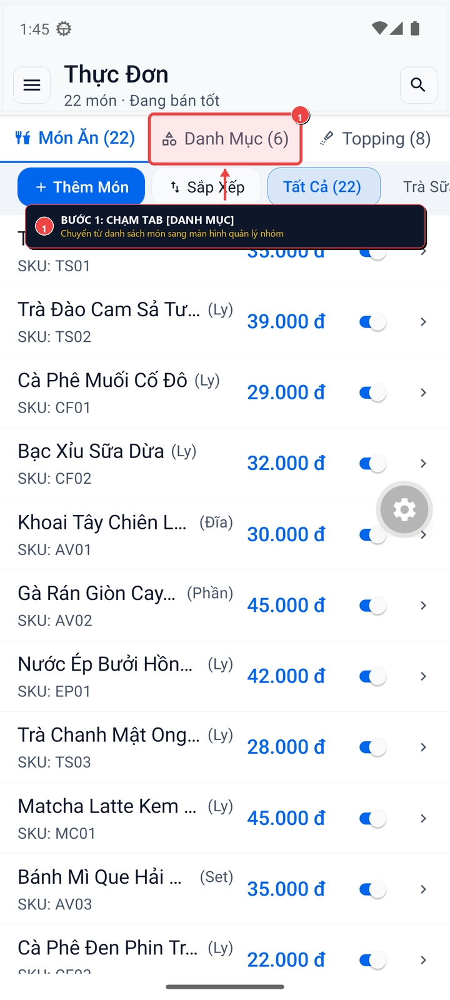
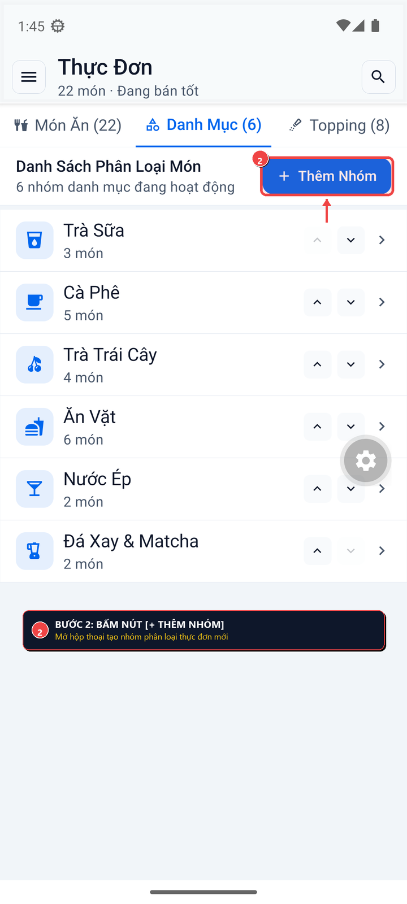
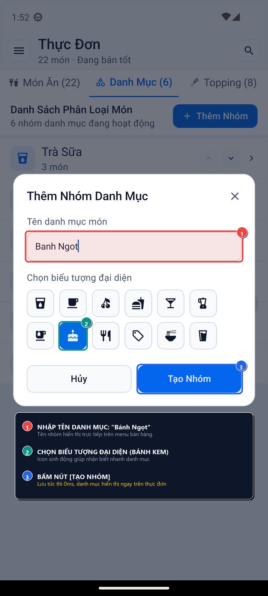
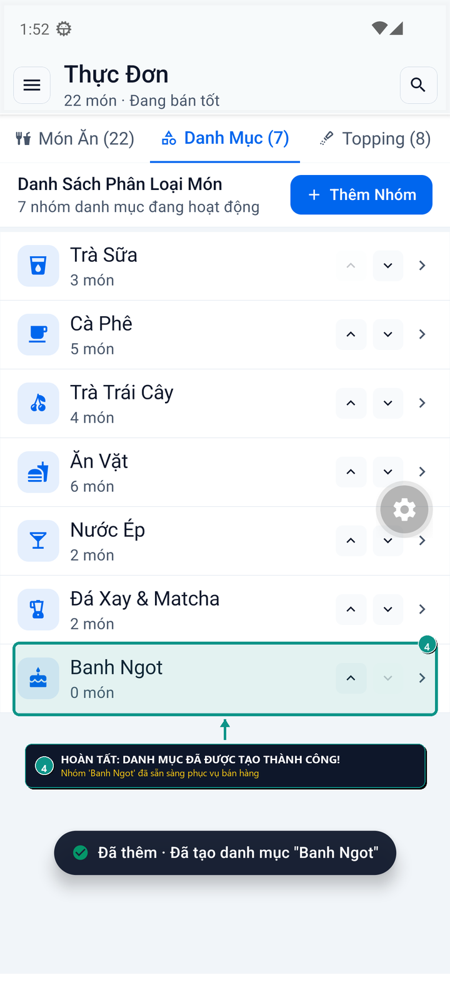

# 📋 HƯỚNG DẪN: TẠO DANH MỤC MẶT HÀNG ĐƠN GIẢN, NHANH CHÓNG
> **OngChu Lean POS — Thiết Lập Menu Thực Đơn 1-Chạm, 0ms Độ Trễ, Đồng Bộ Tức Thì Toàn Hệ Thống**

Tài liệu này hướng dẫn chi tiết từng bước tạo mới danh mục phân loại món ăn / thức uống (Category) trên ứng dụng OngChu POS kèm hình ảnh chụp thực tế có khoanh vùng trực quan.

---

## 🎯 TẠI SAO CẦN TẠO DANH MỤC PHÂN LOẠI CHUẨN?
1. **Tốc độ order giờ cao điểm**: Giúp thu ngân và nhân viên phục vụ chạm 1 lần lọc ngay nhóm món (*Cà Phê, Trà Sữa, Bánh Ngọt, Ăn Vặt...*), tiết kiệm 3-5 giây mỗi lượt khách.
2. **In phiếu Bếp / Bar chuẩn xác**: Món thuộc danh mục đồ uống tự động gửi máy in quầy bar; món ăn vặt tự động gửi máy in bếp nóng.
3. **Báo cáo doanh thu trực quan**: Nắm rõ nhóm mặt hàng nào mang lại lợi nhuận cao nhất trong ngày trên màn hình **Báo Cáo** (`/bao-cao-loi-nhuan`).

---

## 🚀 4 BƯỚC THAO TÁC TRỰC QUAN

### 🟢 BƯỚC 1: TRUY CẬP THỰC ĐƠN & CHỌN TAB "DANH MỤC"
1. Trên màn hình chính POS, mở menu điều hướng (hoặc thanh Rail bên trái) $\rightarrow$ Chọn **Thực Đơn Món Ăn** (`/thuc-don`).
2. Trên thanh chuyển tab trên đỉnh màn hình, chạm vào tab **"Danh Mục"** (biểu tượng thẻ tag phân loại).

> [!NOTE]
> Tab **Danh Mục** hiển thị tổng số lượng nhóm hiện có (ví dụ: `Danh Mục (6)`).

---

### 🟢 BƯỚC 2: BẤM NÚT [+ THÊM NHÓM]
1. Tại thanh tiêu đề phân nhóm, bấm nút **[+ Thêm Nhóm]** (màu xanh thương hiệu Jade ở góc trên bên phải).
2. Hệ thống lập tức mở biểu mẫu tạo nhóm mới trong **0ms**.

---

### 🟢 BƯỚC 3: NHẬP TÊN DANH MỤC & CHỌN BIỂU TƯỢNG (ICON)
1. **Nhập Tên Danh Mục**: Chạm vào ô nhập liệu và gõ tên nhóm món mong muốn:
   - Ví dụ: `Bánh Ngọt`, `Cà Phê Pha Máy`, `Trà Trái Cây`, `Đồ Ăn Nhanh`...
2. **Chọn Biểu Tượng Đại Diện (Icon)**: Chạm vào 1 trong 12 biểu tượng có sẵn phù hợp nhất với nhóm món:
   - ☕ *Ly cà phê*: Nhóm cà phê đen, nâu, latte, cappuccino.
   - 🧋 *Ly trà sữa / ống hút*: Nhóm trà sữa, trà olong trân châu.
   - 🍰 *Bánh ngọt / Dessert*: Nhóm tiramisu, mousse, croissant.
   - 🍟 *Đồ ăn vặt / Mì*: Nhóm đồ chiên rán, xúc xích, snack.
   - 🍹 *Cocktail / Nước ép*: Nhóm sinh tố, nước hoa quả ép tươi.
3. **Bấm [Tạo Nhóm]**: Lưu lại cấu hình ngay lập tức mà không cần chờ đợi.

---

### 🟢 BƯỚC 4: HOÀN TẤT & SẴN SÀNG SỬ DỤNG
1. Danh mục mới vừa tạo lập tức xuất hiện trong danh sách quản lý kèm số lượng `0 món`.
2. **Ngay lập tức**:
   - Màn hình **Bán Hàng Quầy Thu Ngân** (`/`) có thêm chip lọc của danh mục mới.
   - Khi tạo món ăn mới (`Thêm Món`), danh mục này đã sẵn sàng để gán món.
3. **Tùy biến thứ tự**: Sử dụng các phím mũi tên `▲` (Lên) hoặc `▼` (Xuống) bên cạnh mỗi dòng để sắp xếp danh mục ưu tiên bán chạy lên đầu trang.

---

## 💡 MẸO VỊ CHỦ QUÁN (CHỐNG RỐI MENU)
- **Quy tắc 7 Nhóm Vàng**: Một quán F&B vận hành mượt mà chỉ nên duy trì từ **5 đến 7 danh mục chính**. Quá nhiều danh mục sẽ khiến nhân viên mất thời gian vuốt tìm trong giờ cao điểm.
- **Sắp xếp theo thói quen khách gọi**: Đặt danh mục có doanh số cao nhất (VD: *Cà Phê* buổi sáng, *Trà Sữa* buổi chiều) ở vị trí đầu tiên để thu ngân 1-chạm chọn ngay.
- **Chỉnh sửa nhanh**: Chạm trực tiếp vào tên danh mục bất kỳ lúc nào để đổi tên hoặc cập nhật icon mới mà không ảnh hưởng đến các món đã có trong danh mục.
